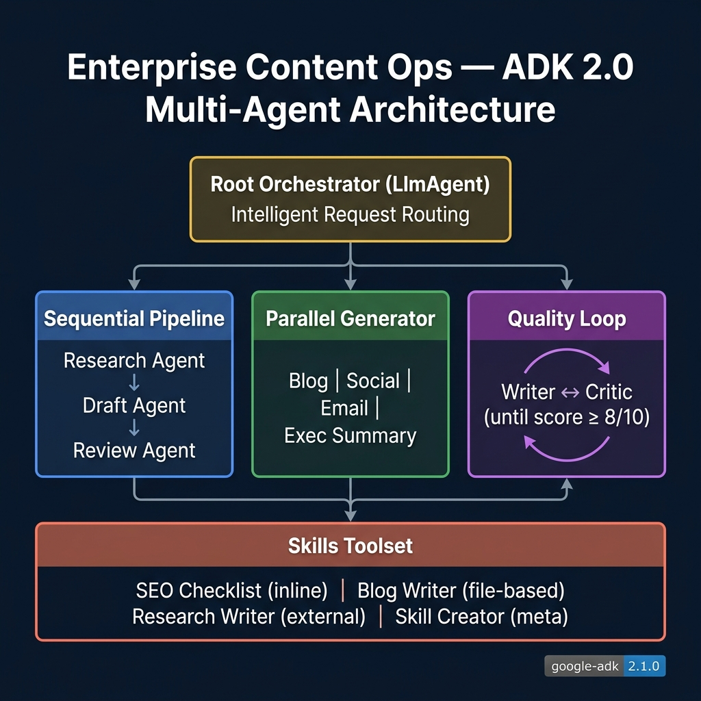

# Enterprise Content Ops — ADK 2.0 Multi-Agent Workflows

An enterprise-grade content operations system built with **Google ADK 2.0** that demonstrates all major multi-agent workflow patterns in a single, deployable project.

<p align="center">
  <strong>SequentialAgent → ParallelAgent → LoopAgent → Skills → Agent Engine</strong>
</p>

## What This Demonstrates

| ADK 2.0 Feature | Implementation | Purpose |
|---|---|---|
| **SequentialAgent** | Content Pipeline | Research → Draft → Review in strict order |
| **ParallelAgent** | Multi-Format Generator | Blog + Social + Email + Exec Summary concurrently |
| **LoopAgent** | Quality Refinement | Write → Critique → Rewrite until score ≥ 8/10 |
| **Inline Skills** | SEO Checklist | Skill defined in Python code |
| **File-based Skills** | Blog Writer, Research Writer | Skills loaded from `SKILL.md` directories |
| **Meta Skills** | Skill Creator | Generates new skill definitions on demand |
| **LLM Routing** | Root Orchestrator | Automatic delegation to the right workflow |
| **Agent Engine** | `deploy.py` | One-command deployment to Vertex AI |

## Architecture

<p align="center">
  
</p>

## Quick Start

```bash
# Clone and setup
git clone https://github.com/pubalisen/enterprise-content-ops.git
cd enterprise-content-ops
python3 -m venv .venv && source .venv/bin/activate
pip install -e .
```

### Configure Credentials (pick one)

**Option A — Google AI Studio (fastest, no GCP needed):**
```bash
echo 'GOOGLE_API_KEY="your-key"' > app/.env
# Get a key at https://aistudio.google.com/apikey
```

**Option B — Vertex AI with gcloud:**
```bash
cat > app/.env << 'EOF'
GOOGLE_GENAI_USE_VERTEXAI=TRUE
GOOGLE_CLOUD_PROJECT=your-project-id
GOOGLE_CLOUD_LOCATION=us-central1
EOF

gcloud auth application-default login
gcloud services enable aiplatform.googleapis.com
```

**Option C — Vertex AI with Service Account:**
```bash
cat > app/.env << 'EOF'
GOOGLE_GENAI_USE_VERTEXAI=TRUE
GOOGLE_CLOUD_PROJECT=your-project-id
GOOGLE_CLOUD_LOCATION=us-central1
GOOGLE_APPLICATION_CREDENTIALS=/path/to/your-service-account.json
EOF
```

### Run

```bash
adk web
# Opens at http://127.0.0.1:8000
```

## Try It

| # | Query | Workflow Triggered |
|---|-------|-------------------|
| 1 | "Write an article about AI in healthcare" | **SequentialAgent** — Full pipeline: Research → Draft → Review |
| 2 | "Take this content about cloud migration and create versions for all our channels" | **ParallelAgent** — Blog + Social + Email + Exec Summary generated concurrently |
| 3 | "Write a really polished thought leadership piece about the future of remote work" | **LoopAgent** — Iterative write → critique → rewrite (up to 3 rounds) |
| 4 | "Review this blog post for SEO issues" | **Skill** — seo-checklist loaded on demand |
| 5 | "Help me research the current state of quantum computing" | **Skill** — content-research-writer with source evaluation framework |
| 6 | "I need a new skill for reviewing legal contracts" | **Meta Skill** — skill-creator generates a new SKILL.md |
| 7 | "What workflows do you have available?" | **Direct** — Root agent explains its capabilities |

## Deploy to Vertex AI Agent Engine

```bash
# Validate locally (dry run)
python deploy.py --dry-run

# Deploy to your GCP project
python deploy.py --project your-project-id --region us-central1

# Deploy with custom name
python deploy.py --display-name "Content Ops v2"
```

### Prerequisites for Deployment
```bash
# Authenticate with GCP
gcloud auth application-default login
gcloud config set project your-project-id

# Enable required APIs
gcloud services enable aiplatform.googleapis.com
```

## Project Structure

```
enterprise-content-ops/
├── app/
│   ├── __init__.py          # Package init
│   ├── agent.py             # Root orchestrator + all workflow agents
│   └── skills/
│       ├── blog-writer/
│       │   ├── SKILL.md            # Blog writing guide
│       │   └── references/
│       │       └── blog-templates.md
│       └── content-research-writer/
│           ├── SKILL.md            # Research methodology
│           └── references/
│               └── source-evaluation.md
├── deploy.py                # Vertex AI Agent Engine deployment
├── .env.example             # Environment template
├── pyproject.toml           # Project config (ADK 2.0)
└── README.md
```

## Key Concepts

### Sequential Pipeline
The `content_pipeline` executes three agents in strict order. Each agent writes its output to a shared state key, which the next agent reads:
```
research_agent → state["research_brief"]
draft_agent    → reads research_brief, writes state["content_draft"]
review_agent   → reads content_draft, writes state["final_content"]
```

### Parallel Fan-Out
The `multi_format_generator` runs four agents simultaneously. They all read from the same input but write to different state keys, producing four format variants in the time it takes to generate one.

### Loop Refinement
The `quality_loop` alternates between a writer and a critic. The critic scores the content on 5 dimensions (clarity, engagement, accuracy, structure, actionability). If the average score is below 8/10, the writer gets the critique and rewrites. Max 3 iterations prevents infinite loops.

### Progressive Skill Disclosure
Skills use a three-level loading pattern:
- **L1**: `list_skills` → Returns only names + descriptions (~200 tokens)
- **L2**: `load_skill` → Loads full instructions when needed
- **L3**: `load_skill_resource` → Fetches reference files on demand

This keeps the context window lean while giving the agent access to deep knowledge.

## Evaluations

ADK has a built-in evaluation framework. Install it and run:

```bash
# Install eval dependencies
pip install "google-adk[eval]"

# Run all response quality evals
adk eval app evals/response_quality.evalset.json \
  --config_file_path evals/eval_config.json

# Run specific eval cases
adk eval app evals/response_quality.evalset.json:routing_lists_workflows,seo_review \
  --config_file_path evals/eval_config.json

# Run with detailed output
adk eval app evals/response_quality.evalset.json \
  --config_file_path evals/eval_config.json \
  --print_detailed_results

# Run trajectory evals (tool call verification)
adk eval app evals/routing_and_skills.evalset.json
```

### Eval Sets

| File | Tests | What it checks |
|---|---|---|
| `response_quality.evalset.json` | 6 | Semantic response matching for all workflows |
| `routing_and_skills.evalset.json` | 6 | Tool call trajectories (list_skills → load_skill) |
| `eval_config.json` | — | Threshold config (default: response_match ≥ 0.2) |

### Tips
- **ROUGE scoring** is strict for generative agents — a 0.2+ threshold is realistic
- Use the **ADK Web UI Evals tab** to capture real sessions and save as eval sets
- Run specific cases with `filename.json:case_id1,case_id2` syntax
- Results are saved in `app/.adk/eval_history/`

## License

Apache License 2.0
